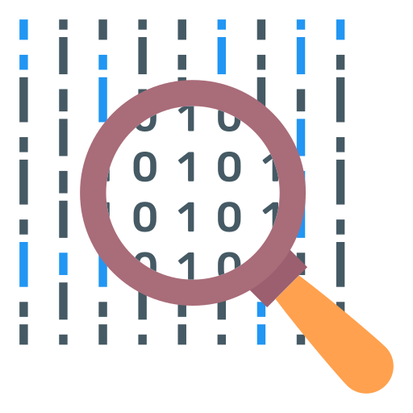

# DATA

## REFERENCES

## GETTING STARTED

> `Data`is the new oil.

In the era of information (we call it data when is storaged into computers), data is a way that the people, companies and governments can better understand the reality, learn impactful insights in a data-driven approach in order to achieve the best actionable solutions.
