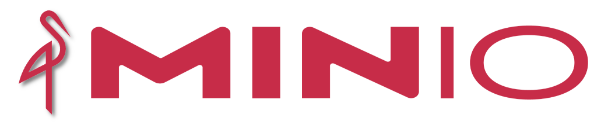

# AWESOME DOCUMENTATION FOR MINIO

## REFERENCES
* [Minio Official](https://min.io/)

## GETTINGS STARTED

**MinIO** is a high-performance, S3 compatible object store. It is built for
large scale AI/ML, data lake and database workloads. It is software-defined
and runs on any cloud or on-premises infrastructure. MinIO is dual-licensed
under open source GNU AGPL v3 and a commercial enterprise license.
