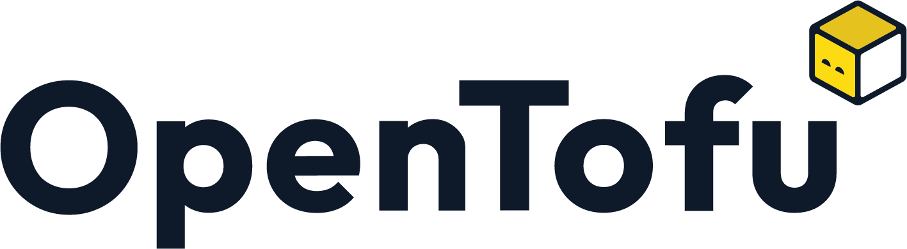

# AWESOME DOCUMENTATION FOR OPENTOFU

## REFERENCES
* [OpenTofu Official](https://opentofu.org/)
* [OpenTofu Docs](https://opentofu.org/docs/)
* [OpenTofu Language](https://opentofu.org/docs/language/)

## GETTING STARTED

**OpenTofu** is an **open-source Infrastructure as Code (IaC) tool** that enables you to define (write), plan, and apply infrastructure changes across multiple cloud providers. It uses **declarative OpenTofu language** to manage infrastructure resources.

**OpenTofu** is a **Terraform fork**, created as an initiative of Gruntwork, Spacelift, Harness, Env0, Scalr, and others, in response to HashiCorp’s switch from an open-source license to the BUSL.
