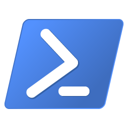

# POWERSHELL: CROSS-PLATFORM TASK AUTOMATION (MICROSOFT) SOLUTION

## REFERENCES
* [Microsoft Powershell Documentation](https://learn.microsoft.com/en-us/powershell/)
* [Microsoft Powershell Training](https://learn.microsoft.com/en-us/training/modules/introduction-to-powershell/)
* [Microsoft .NET](https://learn.microsoft.com/en-us/dotnet/)
* [Microsoft PowerShell Desired State Configuration (DSC)](https://learn.microsoft.com/en-us/powershell/scripting/dsc/overview/dscforengineers)
* [Microsoft Learn Modules](https://learn.microsoft.com/en-us/training/browse/?terms=PowerShell)

## GETTING STARTED

PowerShell is a cross-platform task automation solution made up of a command-line shell, a scripting language, and a configuration management framework. Powershell is build on top of .NET Core, it implements and allow the usage of .NET Core objects.

PowerShell consists of two parts: a command-line shell and a scripting language. It started out as a framework to automate administrative tasks in Windows. PowerShell has grown into a cross-platform tool that's used for many kinds of tasks.

PowerShell shares some features with traditional shells:
* Built-in help system
* Pipeline
* Aliases

PowerShell differs from a traditional command-line shell in a few ways:
* It operates on objects over tex (objects as input and output).
* Commands in PowerShell are called cmdlets (pronounced commandlets). In PowerShell, cmdlets are built on a common runtime rather than separate executables as they are in many other shell environments. This characteristic provides a consistent experience in parameter parsing and pipeline behavior. Cmdlets typically take object input and return objects. The core cmdlets in PowerShell are built in .NET Core, and are open source. You can extend PowerShell by using more cmdlets, scripts, and functions from the community and other sources, or you can build your own cmdlets in .NET Core or PowerShell.
* It has many types of commands (native executables, cmdlets, functions, scripts, or aliases).

PowerShell are multi-platform: it runs on Windows, Linux, and MacOS.

Powershell applications:
* `Operational System Tool`: Command-line that accepts and returns .NET objects.
* `Cloud Management`: To manage cloud resources, as retrieve information about cloud resources, as well as update or deploy new resources.
* `CI/CD operations`: It can also be used as part of a Continuous Integration/Continuous Deployment pipeline.
* `Automate Tasks`: to automate almost any task on Windows.
* `Management Framework`: PowerShell Desired State Configuration (DSC) that enables you to manage your enterprise infrastructure with configuration as code.
* `Server Remote Control`: Access and manage computer servers remotely.
