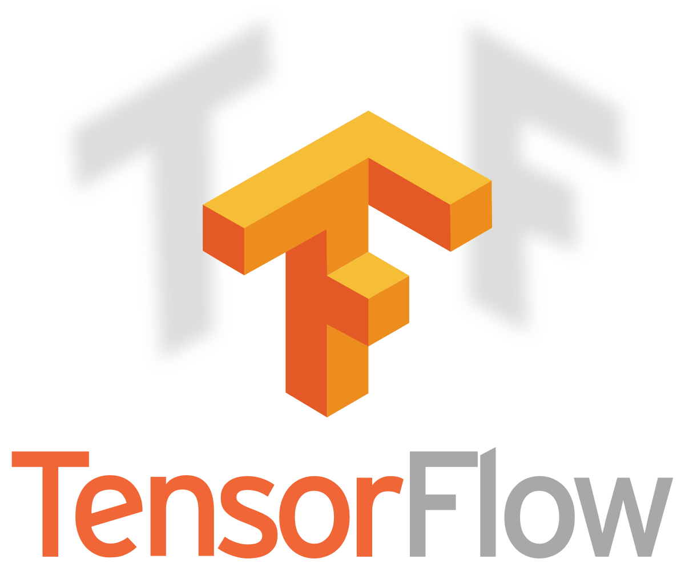

# AWESOME DOCUMENTATION FOR TENSORFLOW

## REFERENCES
* [Tensorflow Official](https://www.tensorflow.org/)
* [Tensorflow Docs](https://www.tensorflow.org/api_docs)
* [Tensorflow Extended](https://www.tensorflow.org/tfx)
* [Tensorflow Hub](https://www.tensorflow.org/hub)
* [Tensorflow Board](https://www.tensorflow.org/tensorboard)
* [Tensorflow Probability](https://www.tensorflow.org/probability)
* [Tensorflow Agents](https://www.tensorflow.org/agents)

## GETTING STARTED

**TensorFlow** is a **free and open-source software library for machine learning and artificial intelligence**. It can be used across a range of tasks but has a particular **focus on training and inference of deep neural networks**. It was **developed by the Google Brain team**.